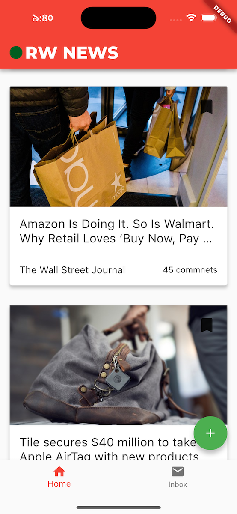

# Flutter UI Widgets Test Drive

I have created this project as part of my learning journey with Flutter, following the [Raywinderlich tutorial series](https://www.kodeco.com/26933987-flutter-ui-widgets) 

In this project, I have explored common UI widgets.

- Explore Basic Widgets
- Build a card widget by combining different layout widgets and learn how to use the Stack widget to lay widgets on top of each other.
- Learn how to work with network and local images and see how assets and resources are managed in Flutter apps.
- Explore different widgets that are used to add scroll functionality to collections of widgets that are larger than the viewport.
- Learn how to setup different Tab based layouts and integrate different screens with different views.
- Learn how to use the FutureBuilder widget to display content gotten from an asynchronous task like fetching data online.
- Add interactions and navigation to your app and learn how to use the CustomScrollView widget to add custom scroll effects with the use of slivers.
- Explore different input widgets and learn how they can be combined to create beautiful forms in your apps.
- Learn how to use different responsive widgets provided by Flutter to create responsive app UI.

  
   
  

